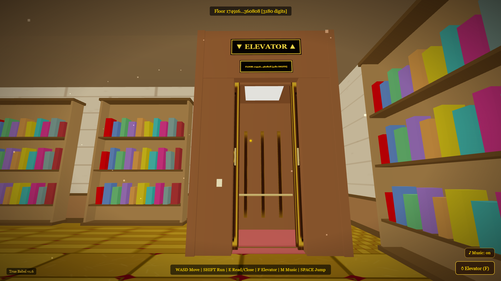
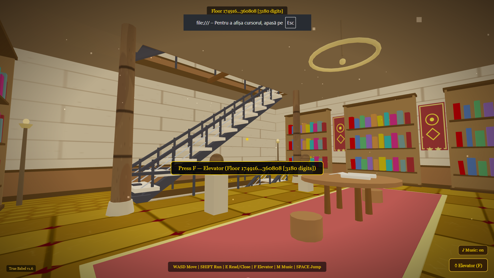
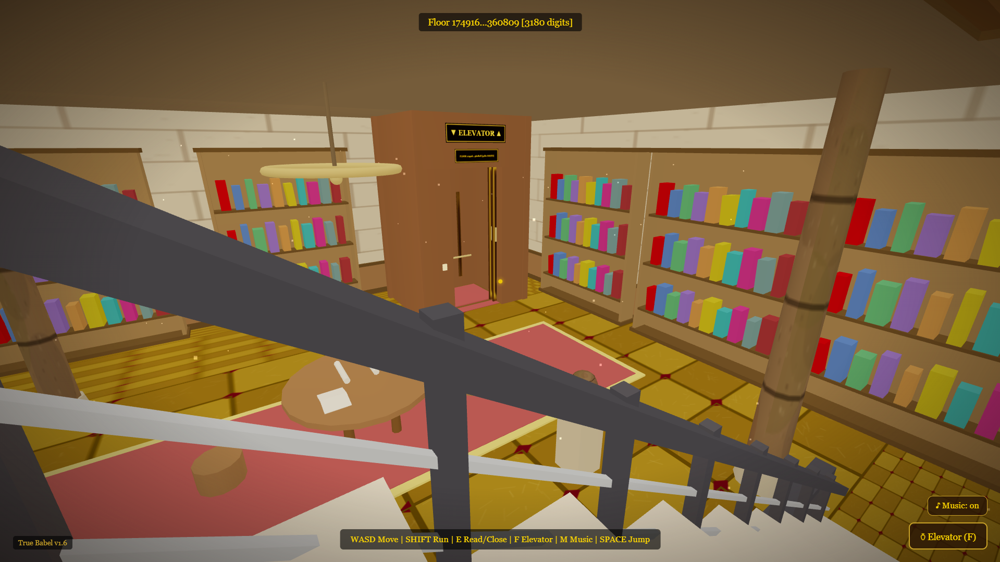
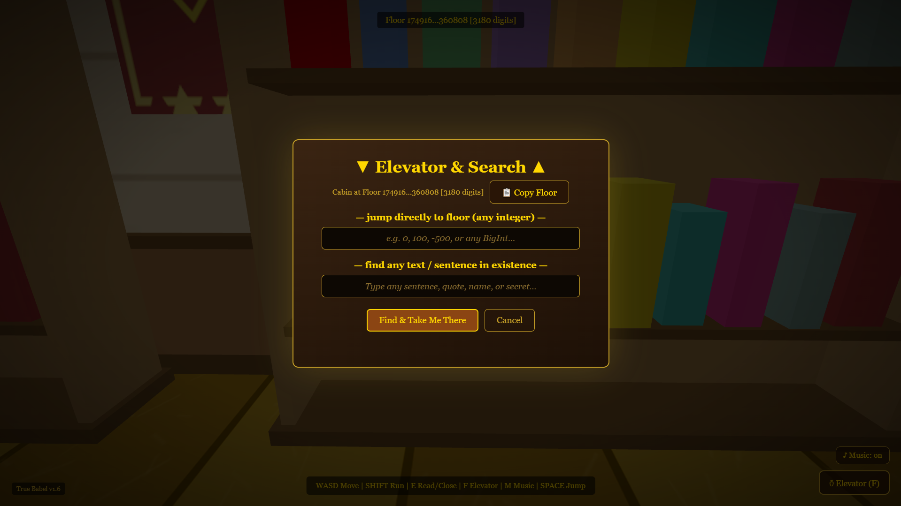
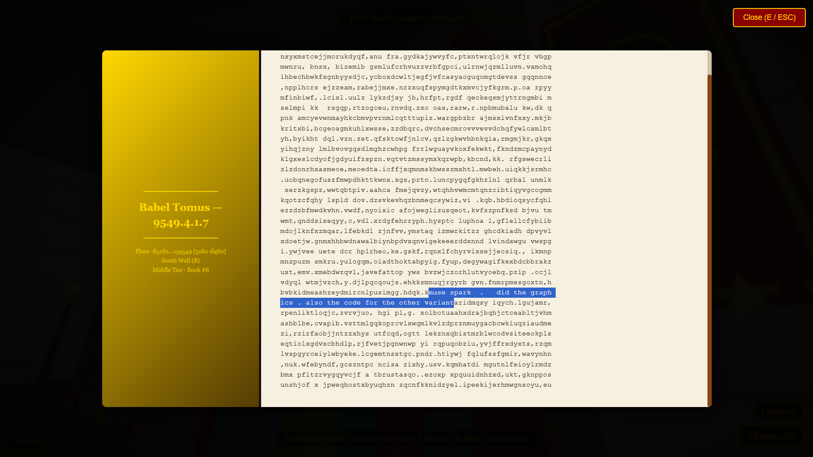

# 🏛️ The Great Library of Alexandria — Digital Babel Engine

An interactive, browser-based 3D first-person simulation of Jorge Luis Borges' universal library, rendered inside the classical architecture of the Great Library of Alexandria.

The repository includes two distinct implementations:
1. **`library_of_alexandria_v81.html`**: The complete 3D environment, procedural textures, interactive elevator, and procedural noise text engine.
2. **`true_babel.html`**: The mathematical **True Digital Babel** engine, replacing pseudo-random loops with an exact, arbitrary-precision $O(1)$ bijection using native JavaScript `BigInt`.


<p align="center">
  
  
</p>
<p align="center">
  
  
  
</p>


---

# 👥 Credits & Attribution

* **3D World, Graphics & Game Mechanics:** Developed and created using **Muse Spark 1.3** (`library_of_alexandria_v81.html`).
* **True Babel Engine, $O(1)$ Inversion & BigInt Physics:** Designed and implemented using **Gemini 3.8 Flash** (`true_babel.html`).
* **Conceptual & Literary Foundation:** Inspired by the 1941 short story *"The Library of Babel"* (*La biblioteca de Babel*) by **Jorge Luis Borges**.

---

## 📖 Overview

In Jorge Luis Borges' 1941 short story *"The Library of Babel"*, a vast universe of hexagonal rooms houses every possible 410-page book constructed from a finite alphabet.

This project recreates that concept inside a classical Egyptian-Hellenistic library hall. Every page, phrase, sentence, or secret you search for mathematically exists at a specific, permanent coordinate (Floor, Shelf, Row, Book) and can be located in under a millisecond.

---

## ⚡ Comparison of Implementations

| Feature | `library_of_alexandria_v81.html` | `true_babel.html` |
| :--- | :--- | :--- |
| **Search Method** | Brute-force PRNG search spiral | Mathematical $O(1)$ Modular Bijection |
| **Coordinate Space** | Standard JavaScript `Number` | Native Arbitrary-Precision `BigInt` |
| **Floor Depth** | Finite range ($\pm 9 \times 10^9$) | Infinite (Supports thousands of digits) |
| **Page Resolution** | 2,200 characters per volume | 2,176 characters (34 lines $\times$ 64 columns) |
| **Search Speed** | Dependent on spiral iterations | Instantaneous ($< 1\text{ ms}$) |
| **Physics Engine** | Floating stair & elevator collisions | Two-axis sliding physics + Map lookups |
| **Audio Engine** | Synthesized Web Audio chords | High-audibility polyphonic ambient synth |

---

## 🧮 How the True Babel Engine Works (`true_babel.html`)

Instead of storing data on a server or scanning through billions of pseudo-random seeds, the engine treats every book as a unique point in an invertible mathematical space:

### 1. Base-29 Text Encoding
Every 2,176-character page is represented using a 29-character alphabet (`a-z`, space, comma, period). A full page is directly converted into an exact integer in base 29:
$$N = 29^{2176} \approx 10^{3182}$$

### 2. Reversible Modular Permutation
To scatter intelligible text pseudo-randomly across the infinite rooms without destroying determinism, the coordinate index $X$ is scrambled using large-integer modular arithmetic:
$$Y \equiv (X \cdot A + K) \pmod N$$

Because $\gcd(A, 29) = 1$, the transformation is uniquely invertible. Given any page of text $Y$, the exact spatial index $X$ is computed instantly via the Extended Euclidean Algorithm ($A^{-1} \pmod N$):
$$X \equiv ((Y - K) \cdot A^{-1}) \pmod N$$

### 3. Spatial Deconstruction
The single integer $X$ is unpacked into continuous 3D coordinates:
* **Floor Number:** $\lfloor X / 240 \rfloor$ (Interleaved positive/negative)
* **Shelf:** $(X \pmod{240}) / 30$ (8 shelves per hall)
* **Row:** $((X \pmod{240}) \pmod{30}) / 10$ (3 vertical tiers)
* **Book:** $(X \pmod{240}) \pmod{10}$ (10 books per row)

---

## 🎮 Controls

| Action | Key / Input |
| :--- | :--- |
| **Move** | `W` `A` `S` `D` |
| **Sprint** | `Shift` + Movement |
| **Look** | `Mouse` (Pointer Lock) |
| **Jump** | `Space` |
| **Read / Close Book** | `E` or `Esc` |
| **Elevator & Search Menu** | `F` |
| **Toggle Ambient Music** | `M` |

---

## 🛠️ Tech Stack & Architecture

* **Renderer:** [Three.js](https://threejs.org/) (WebGL)
* **Procedural Textures:** Dynamic HTML5 Canvas generation (oak wood grain, marble slabs, woven banners, stone reliefs).
* **Audio Synthesis:** Real-time polyphonic ambient soundscapes via the browser's native **Web Audio API** (no external `.mp3` or `.wav` dependencies).
* **Mathematics:** Arbitrary-precision integer arithmetic (`BigInt`).
* **Packaging:** 100% standalone single-file builds (Zero install, zero build step).

---

## 🚀 Getting Started

No servers, build tools, or dependencies need to be installed.

1. Clone the repository:
   ```bash
   git clone [https://github.com/your-username/great-library-of-alexandria.git](https://github.com/your-username/great-library-of-alexandria.git)
